# MeteoriteLanding_MongoDB


## Introducción

Este es un informe que recopila los apartados de este mini proyecto para poner en uso mis conocimientos en bases de datos NO SQL en MongoDB. Mi intención es realizar un caso práctico con un Dataset, realizar diversas consultas y sacar una conclusión a partir de los resultados. Esta herramienta nos permite, a diferencia de otros softwares, trabajar de forma más rápida y flexible, ya que escala muy cómodamente con los grandes conjuntos de datos.  

El conjunto de datos con los que vamos a trabajar proviene de [GitHub](https://github.com/jdorfman/awesome-json-datasets#nasa), que recopila parte de los asteroides caídos durante la historia. Estos datos están facilitados por la NASA y los cuales registraran la localización de impacto, la masa, composición y año de caída entre otros. Algunas de las entradas contienen datos faltantes o incorrecciones en los análisis de la propia NASA como, por ejemplo, las coordenadas latitud y longitud cero (oeste africano), donde es más difícil avistarlos. Lo mismo pasa con la zona de la Antártida. 

Cada meteorito se compone de las siguientes categorías: 
- **name**: Nombre del meteorito (suele ser la zona donde se cae, modificado con su composición, año, etc.). 
- **id**: identificador único. 
- **nametype**: variable categórica que tiene dos posibles valores: 
    - valid: meteorito clásico. 
    - relict: meteorito que ha sufrido alta degradación climatológica terrestre. 
- **recclass**: la clase del meteorito; un número basado en la composición física, química y otras propiedades. Este artículo en Wikipedia los recopila. 
- **mass**: masa del meteorito en gramos. 
- **fall**: determina si el meteorito se vio caer, o fue descubierto tras el impacto: 
    - fell: el meteorito fue avistado antes del impacto. 
    - found: el meteorito fue descubierto tras impacto. 
- **year**: año en el que se avistó o encontró el meteorito (depende el valor del campo anterior). 
- **reclat**: latitud donde aterrizó el meteorito. 
- **reclong**: longitud donde aterrizó el meteorito. 
- **Geolocation**: combina las coordenadas de latitud y longitud en forma de tupla. 


## Cargar/importar un dataset

Una vez encontrado un conjunto de datos interesante, debemos comprobar si este puede descargarse en formato JSON. Gracias a las nuevas funcionalidades de Mongo, podemos importar el fichero de forma sencilla (sin tener que acudir a la consola del sistema) en Import → Import from 
JSON and CSV files… → Add file y seleccionar la inserción *‘Drop collection first if it exists’* para que elimine la colección si ya existe, y así realizar una importación limpia. 


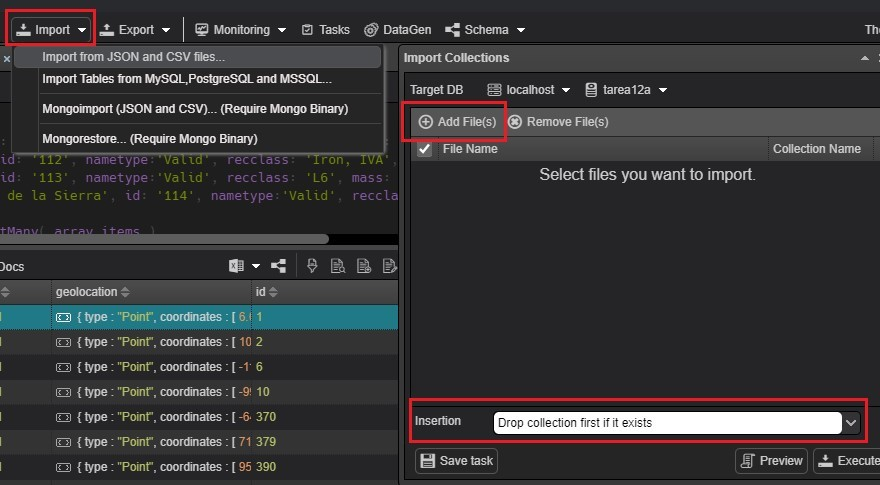

## Consultas sobre los datos

Antes de consultar los datos, vamos a ver cómo podríamos nosotros insertar nuestras propias entradas y actualizar sus campos. Estas inserciones y actualizaciones los realizo en una colección aparte con el fin de no alterar los resultados del siguiente apartado. 

Vamos a insertar primero un único objeto con todos los campos sin nulos y en el mismo formato que en el dataset original. 


```bash
  var nuevo_item = {  
 	name: 'Madrid',
    id: '110',
    nametype:'Valid',
    recclass: 'Iron',
    mass: '1000',
    fall: 'Fell',
    year: '2005-01-01T00:00:00.000',  
 	reclat: '45',
    reclong: '45',
    geolocation: {type:'Point', coordinates: [45,45]} } 
 
 	db.meteorite2.insertOne( nuevo_item ) 

```

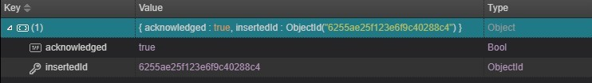


Insertar de uno en uno no es la forma más productiva de rellenar una base de datos, es por eso por lo que nos puede interesar insertar un array de objetos. (Con el objetivo de no rellenar páginas con código redundante se escribirán solo las primeras líneas). 

```bash
    var array_items= [ 
 	    { name: 'Paris', id: '111', recclass: 'Iron', … }, 
 	 	{ name: 'Londres', id: '112', recclass: 'L6’, … }, 
 	 	{ … }] 
          
    db.meteorite2.insertMany( array_items ) 
``` 

Una vez insertados ya podemos realizar búsquedas y modificar los datos en caso de haber introducido alguna errata. 

```bash
    var query= { 'recclass': 'Iron' }

    db.meteorite2.find( query ) 
```

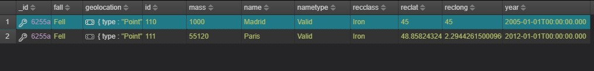

Nos hemos dado cuenta de que la masa está en formato *string*, lo que nos puede dar problemas en un futuro si quisiéramos realizar algún cálculo. Vamos a actualizar el campo de la masa convirtiendo su valor a *double*.  

```bash
    db.meteorite2.updateMany({ },[{$set:{"mass":{$toDouble:'$mass'}}}]) 
```

Con las fechas nos pasa lo mismo, además de que le acompaña información que es irrelevante. Vamos a crear un nuevo campo que solo contenga el año. 

```bash
    var anio = {$year:{$dateFromString:{dateString: '$year'}}}
    var fecha = {'Anio': anio} 
 
 	db.meteorite2.updateMany({},[{$set:{'Anio':anio}},{$unset:'year'}]) 

```

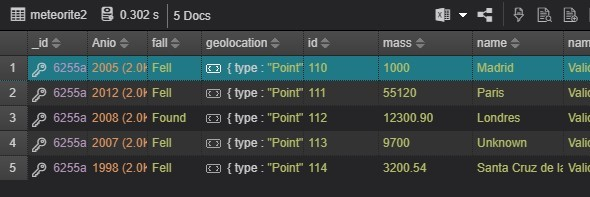

Las consultas sobre los datos siguen un orden de menos a más de dificultad y en algunos casos una consulta surge del resultado de la anterior. El primer paso es realizar un vistazo general al conjunto y comprobar que todo parece estar en orden.  

    1.	db.meteorite.find() 
    2.	db.meteorite.find().count() 

Con estas dos instrucciones obtenemos un primer contacto con los datos. A primera vista, sabemos que deberemos tener en cuenta para un futuro que, por ejemplo, la masa y las fechas no están en su correspondiente formato. 

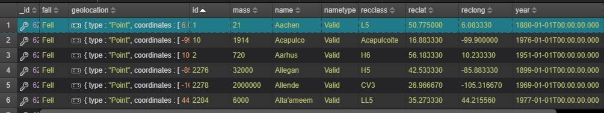

Empezamos con dos consultas sencillas, en las que consultamos que meteoritos son los más recientes y antiguos. 


    3.	db.meteorite.find({},{_id: 0, 'name': 1, 'year': 1}).sort({year: -1}).limit(5)
    4.	db.meteorite.find({}, {_id: 0, 'name': 1, 'year': 1}).sort({year: 1}).limit(5)  

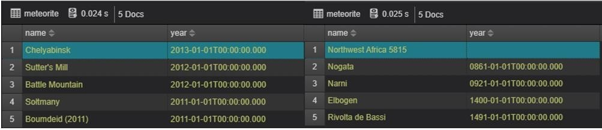


Viendo los resultados de la consulta anterior, nos puede interesar saber cuántos meteoritos han sido registrados por año. Para eso, primero tenemos preparar el campo year, ya que se encuentra en formato de texto y contiene información irrelevante. Esta consulta es más fácil de ver si separamos los distintos pasos que transforman la fecha y formatean la salida. 

```bash
    var anio = { $year:{ $dateFromString:{ dateString: '$year' }} } 
    
    var fecha = { 'Anio': anio } 
    var fase1 = { $addFields: fecha } 
 	var fase2 = { $group: {_id: '$Anio', Suma: {$sum: 1}} } 
 	var fase3 = { $sort: {Suma: -1} } 
 	var fase4 = { $limit: 5 } 
 
 	var etapas = [ fase1, fase2, fase3, fase4 ] 

```
    5.	db.meteorite.aggregate(etapas) 

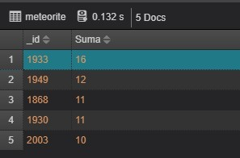

Vamos a ver cuál es el total de meteoritos que han sido avistados en el cielo o encontrados en la superficie.

    6.	db.meteorite.aggregate([{$group:{_id: '$fall', Total: {$sum: 1}}}, {$sort: {Total: -1}}])  

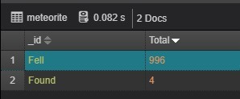


En este caso, hacer la proporción es bastante irrelevante, ya que sólo son dos posibles dos estados (avistado o encontrado) y el total de muestras es 1000. Con la siguiente consulta seríamos capaces de sacar la proporción sin problemas.  

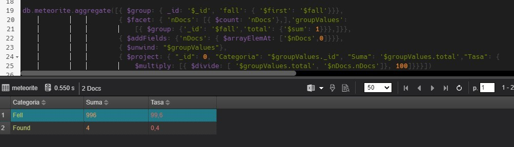

Vamos a comprobar que meteoritos no tienen geolocalización registrada. 

    7.	db.meteorite.find(
        {'geolocation': { $exists: false, $not: {$size: 0}} }, 
        {'_id': 0, 'name': 1,'fall': 1, 'reclat':1, 'reclong':1, 'year':1 })
        .sort({fall: -1})   #.count() 

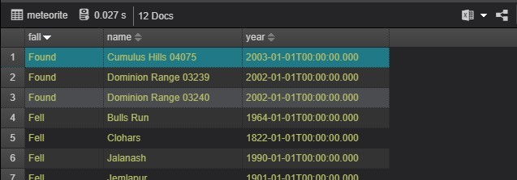

Como podemos observar, los meteoritos que no tienen geolocalización tampoco tienen información en los campos latitud y longitud. Es curioso que tres de los cuatro meteoritos que fueron encontrados no tengan registrado unas coordenadas. Si al final de la consulta añadimos *‘.count()’* sabremos el total de objetos sin geolocalización (12 en total). 

Pasemos ahora a realizar consultas sobre las clases y tipo de meteoritos. Vamos a ver cuántas categorías existen. 

    8.	db.meteorite.aggregate([{$group:{_id: '$recclass', Total: {$sum: 1}}}, {$sort: {Total: -1}}]) 

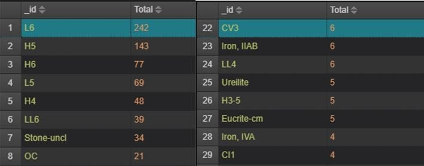

Con esta consulta tenemos un problema, y es que con un ‘.count()’ nos dice que existen 118 categorías diferentes. Esta consulta en realidad nos está mostrando las distintas combinaciones u subcategorías que existen (se puede ver en las entradas 23 y 28 en la ilustración de la consulta 6). 

Siguiendo el ejemplo del hierro, no nos puede quedar claro cuál es el total de meteoritos metálicos. Por ello, vamos a filtrar los tipos para que muestre, por ejemplo, aquellos meteoritos que pertenezcan al grupo metálico. *(Count: 45)*


    9.	db.meteorite.find({recclass: {$regex: /^iron/i}},
        {'_id': 0, 'name': 1,'recclass': 1, 'mass':1 }).sort({'name': 1}) 


La salida anterior nos muestra que el grupo metálico tiene una masa relativamente relevante. Vamos a comprobar si es esto cierto. 

    10.	db.meteorite.aggregate(
            [{$unwind: '$recclass'},
            {$group:  
 	 	 	    {_id:'$recclass', Media: {$avg:{ $toDouble: '$mass'} }}}, 
                { $sort: {Media: -1}}, 
                { $project:{_id:'$_id', roundAvg: {$ceil:'$Media'}}}, 
                { $limit: 10}]) 


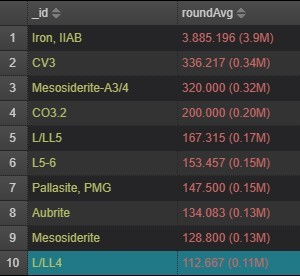

Durante la elaboración de este proyecto me han surgido varias cuestiones relacionadas con las coordenadas de impacto en los meteoritos y si había alguna variable que afectase sobre esta, como pudiera ser la gravedad o el campo magnético. 

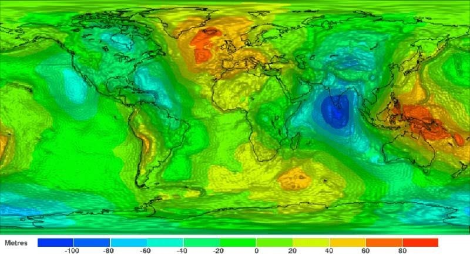


Con el objetivo de buscar alguna relación entre las variables, vamos a ver si los meteoritos tienen una zona favorita de impacto y si coinciden con las zonas de más alto nivel de gravedad y magnetismo. Para ello, vamos a dividir el proceso en fases y así tener una mejor visión de como se van tratando los datos. 

```bash
    var zona ={$round:[{$divide : [{ $toDouble: '$reclat'}, 10]}, 0]} 
 	var zonaCampo = { 'Zona': zona }

    var fase1 = { $addFields: zonaCampo }
    var fase2 = { $group: {_id: '$Zona', Suma: {$sum: 1}}} 
 	var fase3 = { $sort: {_id: -1}} 
 
 	var etapas = [ fase1, fase2, fase3] 
```

    11. db.meteorite.aggregate(etapas)

Esta consulta se realiza dos veces, una con la latitud y otra con la longitud, con el objetivo de poder construir una zona en un mapa e intentar darle una explicación. La salida latitudinal abarca 180º, desde la Antártida (-90º), hasta el polo norte (+90º), y la salida longitudinal los 360º (de Alaska a Nueva Zelanda).

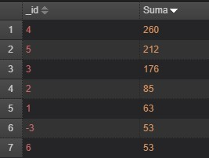
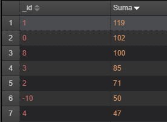

Si reflejamos en un mapa las cinco primeras zonas donde **más se repiten** las colisiones nos queda de la siguiente forma: 


Ahora vamos a ver si sucede lo mismo con meteoritos metálicos, para ello, añadimos al código anterior una nueva fase de filtrado que recupera los meteoritos que tengan algún componente metálico. 

```bash
    var filtro = {recclass: {$regex: /^iron/i}} 
 	var faseFiltro = { $match: filtro } 
 
 	var detapas = [ fase1, faseFiltro, fase2, fase3] 
```

    12. db.meteorite.aggregate( detapas ) 


Hacemos lo mismo en el mapamundi con los cinco primeros resultados: 

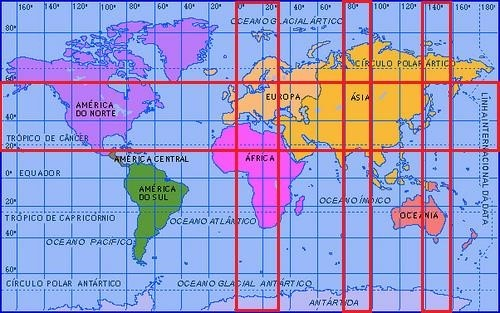


## Conclusiones

A primera vista parece que las coordenadas sí tienen alguna relación, por lo menos, con el campo gravitatorio terrestre. Puede ser común pensar que la variable magnética también afecte a la trayectoria, pero debido a que los meteoritos no tienen una composición 100% metálica, concluimos que dicho factor tiene poca relevancia. Aunque influyan otros aspectos que no tengamos en cuenta, como es la aerodinámica, la velocidad o ángulo con el que entran en la atmósfera, parece ser que los meteoritos tienen un comportamiento predecible, cuando se puede llegar a pensar lo contrario. Tal vez sea coincidencia con que la zona central sea la parte más expuesta de La Tierra. Para ello deberíamos realizar un análisis con herramientas como R Studio y verificar dicha conjetura. 

Un campo que a mi parecer hubiera sido interesante conocer sería el radio o la densidad del meteorito, ya que me quedé un poco extrañado con la consulta sobre la masa media, ya que los que contenían propiedades metálicas, aparecían siempre en el top cinco de peso promedio. 

Este Dataset contiene la cantidad de mil registros, sin embargo, en toda la historia de la humanidad se han registrado más de 45.000 muestras. En un principio parecen pocos registros, pero, hay que tener en cuenta que muchas de estas entradas al fin de al cabo son piedras que no llegan ni al kilo, y observar estos cuerpos en el pasado no era tarea sencilla, por eso, la gran mayoría de entradas tienen fechas superiores al siglo XIX. 
